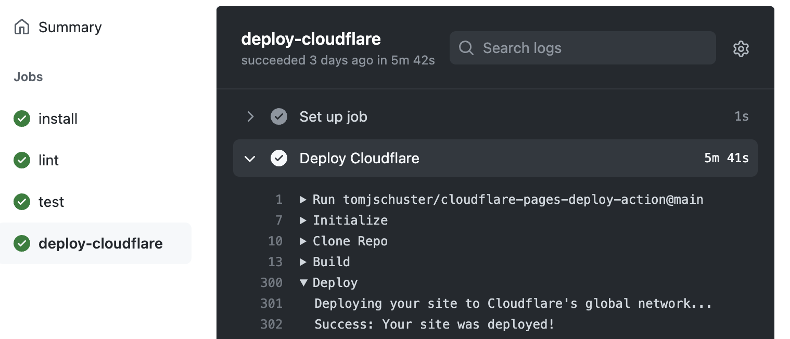

<p align="center">
  <a href="https://github.com/tomjschuster/cloudflare-pages-deploy-action/actions/workflows/test.yml?query=branch%3Amain"></a>
  <a href="https://coveralls.io/github/tomjschuster/cloudflare-pages-deploy-action?branch=main"></a>
</p>

# Cloudflare Pages Deploy Action

Triggers a production and preview [Cloudflare Pages](https://pages.cloudflare.com/) deployments using the [Cloudflare v4 API](https://api.cloudflare.com/) and tracks the progress of the deployment across all stages, allowing you to fully integrate Cloudflare Pages deployments into your existing CI pipelines. Optional GitHub Deployments can also be associated with your preview branches and production environment.



## Important Limitations

- The Cloudflare v4 API [`Create deployment`](https://api.cloudflare.com/#pages-deployment-create-deployment) endpoint only supports creating production deployments. This action achieves triggering preview deployments by creating, triggering and then deleting a [Deploy Hook](https://developers.cloudflare.com/pages/platform/deploy-hooks) **using undocumented endpoints**. This means:
  - If hook deletion fails, there will be an active webhook created for your project that you will need to delete manually. The action logs should indicate when this has happened.
  - Because the Create/Delete Deploy Hook endpoints are not officially supported, this functionality could break at any moment. Production deployments are built on the official API, but preview deployments are not, and it is possible that this preview deployments could stop working completely.
- This action does not upload any builds to Cloudflare, it simply triggers a Pages deployment, which builds and deploys your site from Cloudflare's servers. Cloudflare does not currently provide anyway to upload assets directly to a Pages site. (This also means it is not technically necessary to have a separate build step for this action to succeed.)

If non-production deployments are ever supported by `Create deployment` in the future, this action can be updated to stop relying on creating/deleting deploy hooks. If you are not comfortable with this action creating/deleting deploy hooks on every preview deployment using unsupported endpoints, please look at some official alternatives below.

### Alternatives

Cloudflare's official [Pages integrated GitHub application](https://github.com/apps/cloudflare-pages) supports [preview deployments](https://developers.cloudflare.com/pages/platform/preview-deployments) for pull requests in addition to production deploys. Following the [Getting Started guide](https://developers.cloudflare.com/pages/get-started) for GitHub will enable this by default. The status of these deploys will be associated with the proper GitHub branch, however, the deployments will always be triggered immediately on any push to your production branch or pull request and cannot be integrated into any existing CI flows (e.g. there's no way to defer a production deploy until other actions have passed).

Cloudflare pages can also be deployed using [Deploy Hooks](https://developers.cloudflare.com/pages/platform/deploy-hooks). Hooks can be created for deploying to specific branches from your Pages project's Settings. Hooks can be integrated an existing CI flows for specific branches (e.g. production, staging), however they will not create any checks associated with your production branch or any pull request so there will be no feedback about the status of the build the on your production branch or pull requests. Similar to this action's limitations, hooks cannot be used for preview environments for all pull requests.

If you are looking to perform actions after a Pages deploy completes (such as purging caches), [Cloudflare Pages Await](https://github.com/marketplace/actions/cloudflare-pages-await) tracks deployments in a GitHub action and also creates a GitHub Deployment associated with your production environment or pull request. This action can be used with the official application and with deploy hooks.

## Inputs

It is recommended that you use [Encrypted Secrets](https://docs.github.com/en/actions/security-guides/encrypted-secrets) for storing/accessing these values:

| Name         |          | Description                                                                                                                                                                                                                                                                                                                            |
| ------------ | -------- | -------------------------------------------------------------------------------------------------------------------------------------------------------------------------------------------------------------------------------------------------------------------------------------------------------------------------------------- |
| account-id   | Required | Your Cloudflare account id. This is the id in the URL of Cloudflare's dashboard. You can also run the command `wrangler whoami` .                                                                                                                                                                                                      |
| api-key      | yes      | Your [ Cloudflare Global API Key ] ( https://developers.cloudflare.com/api/keys#view-your-api-key ) (Pages does not accept API tokens).                                                                                                                                                                                                |
| email        | yes      | The email associated with your Cloudflare account.                                                                                                                                                                                                                                                                                     |
| project-name | yes      | The name of your Pages project.                                                                                                                                                                                                                                                                                                        |
| production   | no\*     | If true, triggers a production Pages deployment. Either production or branch must be provided (but not both).                                                                                                                                                                                                                          |
| branch       | no\*     | Triggers a Pages preview deployment for the provided branch. Either production or branch must be provided (but not both).                                                                                                                                                                                                              |
| github-token | no       | GitHub access token. If provided, triggers a GitHub deployment with the status of the Pages deployment. If using the Actions provided [`GITHUB_TOKEN`](https://docs.github.com/en/actions/security-guides/automatic-token-authentication), deployments will only work if the current repo is associated with the target Pages project. |

## Outputs

| Name           | Description                                                                                                                                            |
| -------------- | ------------------------------------------------------------------------------------------------------------------------------------------------------ |
| deployment-id  | Unique identifier of the deployment created by the action.                                                                                             |
| deployment-url | Even though this action deploys the production branch, this will be the the build-specific pages URL (e.g. `https://a6975138.example-site.pages.dev`). |

## Example

Add a workflow (`.github/workflows/deploy-production.yml`):

```yaml
name: Deploy to production

on:
  push:
    branches:
      - main

jobs:
  deploy:
    runs-on: ubuntu-latest
    steps:
      - uses: tomjschuster/cloudflare-pages-deploy-action/v0
        with:
          account-id: '${{ secrets.CF_ACCOUNT_ID }}'
          api-key: '${{ secrets.CF_GLOBAL_APIKEY }}'
          email: '${{ secrets.CF_EMAIL }}'
          project-name: '${{ env.PAGES_PROJECT_NAME }}'
          production: true
        env:
          PAGES_PROJECT_NAME: my-pages-project
```

Add a workflow (`.github/workflows/deploy-preview.yml`):

```yaml
name: Deploy preview

on:
  pull_request:

jobs:
  deploy:
    runs-on: ubuntu-latest
    steps:
      - uses: tomjschuster/cloudflare-pages-deploy-action/v0
        with:
          account-id: '${{ secrets.CF_ACCOUNT_ID }}'
          api-key: '${{ secrets.CF_GLOBAL_APIKEY }}'
          email: '${{ secrets.CF_EMAIL }}'
          project-name: '${{ env.PAGES_PROJECT_NAME }}'
          branch: ${{ github.head_ref }}
          github-token: ${{ secrets.GITHUB_TOKEN }}
        env:
          PAGES_PROJECT_NAME: my-pages-project
```

Or combine production and preview in a single job:

```yaml
name: CI

on:
  push:
    branches:
      - main
  pull_request:

  deploy:
    runs-on: ubuntu-latest
    steps:
      - name: Deploy preview
        if: ${{ github.event_name == 'pull_request' }}
        uses: tomjschuster/cloudflare-pages-deploy-action@v0
        with:
          account-id: '${{ secrets.CF_ACCOUNT_ID }}'
          api-key: '${{ secrets.CF_GLOBAL_APIKEY }}'
          email: '${{ secrets.CF_EMAIL }}'
          project-name: '${{ env.PAGES_PROJECT_NAME }}'
          branch: ${{ github.head_ref }}
          github-token: ${{ secrets.GITHUB_TOKEN }}

      - name: Deploy production
        if: ${{ github.ref == 'refs/heads/main' && github.event_name == 'push' }}
        uses: tomjschuster/cloudflare-pages-deploy-action@v0
        with:
          account-id: '${{ secrets.CF_ACCOUNT_ID }}'
          api-key: '${{ secrets.CF_GLOBAL_APIKEY }}'
          email: '${{ secrets.CF_EMAIL }}'
          project-name: '${{ env.PAGES_PROJECT_NAME }}'
          production: true
          github-token: ${{ secrets.GITHUB_TOKEN }}
```

## License

The scripts and documentation in this project are released under the [MIT License](LICENSE).
